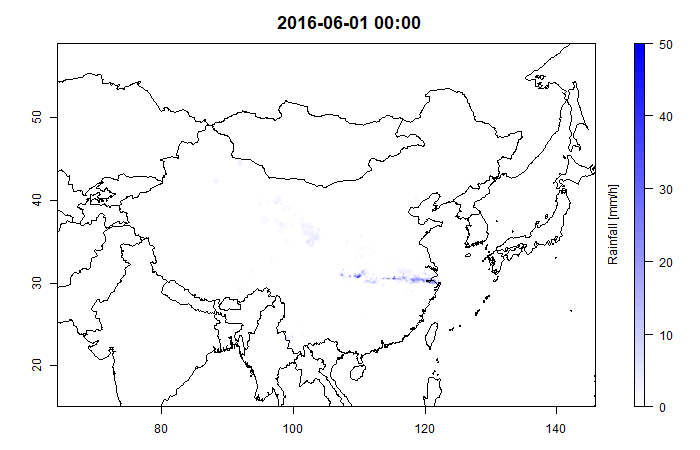

# pFromGrADS.R
R function for building hourly precipitation time series from multiple single-level GrADS data sets.

The script contains function 'pFromGrADS', which takes as input multiple (hourly) single-level GrADS data sets (one GrADS file per hour, file extension '.grd'), uses R's `readBin` to read the binary data as a stream and `extract` s (using R's raster package) precipitation values at user-defined coordinates (contained in file 'coords.txt'). Results are written out in the form of a text file containing the time points ('dateTime' column) and their corresponding rainfall depths for all user-given points in the coordinates file. The timestamps in the dateTime column of the output text file are based on the GrADS file names (see below). The function returns a list containing all rasters (one per time step).

The function takes as parameters:
- coordFile = text file containing the coordinates (columns: lat, lon) and names (colum: label) of the points where rainfall depths are to be extracted from the GrADS data
- gridsPath = path to the GrADS data
- outFile = output file with path
- bbox = 'bounding box', that is, x and y coordinates of the vertices of the GrADS data's enclosing rectangle. This is simply a vector of the form xmin=\<value\>, xmax=\<value\>, ymin=\<value\>, ymax=\<value\>)
- nx = number of columns of GrADS data set
- ny = number of rows of GrADS data set
- naValue = NA identifier in GrADS data set
- p4str = proj4 string of GrADS data set's coordinate reference system
- dateTimeSep = character preceeding the time stamp in the GrADS file name. For instance, in a file named 'xxxxxx.xxxxx_xxxx-2020070610.grd', dateTime would be 2020070610. This string is copied without modifications into the corresponding row of the output file's dateTime column.

## Example application

Assuming all required data (GrADS grids, coordinates file and script with function) are located at c:\data:

```R
# source script with function
source('c:/data/pFromGrADS.R')

# call function using the given input parameters
rList <- pFromGrADS(coordFile='c:/data/coords.txt',
					gridsPath='c:/data/grids/',
					outFile='c:/data/rain.txt',
					bbox=c(xmin=70.05, xmax=140.05, ymin=15.05, ymax=59.05),
					nx=700,
					ny=440,
					naValue=-999,
					p4str="+proj=longlat +datum=WGS84",
					dateTimeSep='-')
```

The resulting output file contains the time stamps in the first column (which are built using the GrADS files' names) and the corresponding rainfall depth at each time step for each coordinate point in coordFile:

| dateTime |zone1 |zone2 | zone3 | zone4 | zone5 |
| -------- | ---- | ---- | ----- | ----- | ----- |
| 2019101519 | 0| 0 | 0 | 0 | 0 |
| 2019101520 | 0| 3.35 | 0 | 0 | 0 |
| 2019101521 | 0| 0.25 | 0 | 0 | 0 |
| 2019101522 | NA| NA | NA | NA | NA |
| 2019101523 | NA| NA | NA | NA | NA |


A GIF animation of the extracted data can be created using pakage `animation`(requires in turn [ImageMagick](https://imagemagick.org/index.php)):

```R
require(raster)
require(RColorBrewer)
require(animation)

# read background shapefile
bg <- raster::shapefile('c:/data/bgShapefile.shp')

# create animation looping over rList
animation::saveGIF({
  for(i in 1:length(rList)){
    ti <- format(as.POSIXct(names(rList)[i], format='%Y%m%d%H', tz='Etc/GMT+8'),
                 format='%Y-%m-%d %H:%M')
    rri <- rList[[i]]
    
    breaks <- seq(0, 80, by=1)
    nbreaks <- length(breaks)-1
    colfunc <- colorRampPalette(c(NA, "blue"))
    par(mar=c(3, 4, 3, 4))
    plot(rri, zlim=c(0, 80), legend=FALSE, box=FALSE, xlab="", ylab="",
         cex.axis=1, col=colfunc(nbreaks))
    plot(bg, add=TRUE)
    plot(rri, legend.only=TRUE, col=colfunc(nbreaks), zlim=c(0, 80),
         legend.width=1, legend.shrink=1,
         legend.args=list(text='Rainfall [mm/h]', side=2, font=1, line=1, cex=1))
    title(ti, cex.main=1.5)
  }
}, 
movie.name='c:/data/20160601.gif', ani.width=700, ani.height=450)
```


